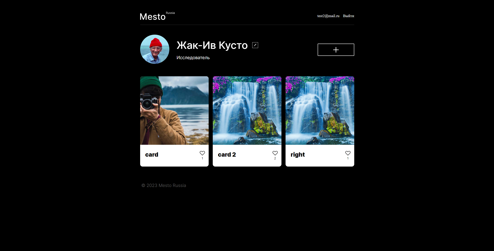

# Project Mesto
___
## Used technologies: 
- React
- NodeJS
- Express
- React-Router
- Joi
- Bcrypt
- Celebrate
___

Project allows to share your photos, watch and like the photos of other users.
There is a registration/authentication, ability to change the profile name and description as well as profile avatar.
___

To start the project, you should follow the next steps:
- clone the repo, using the **git clone 'repo url'**
- then enter the **'npm ci'** in the folders of frontend and backend
- run the **'npm run dev'** in the terminal of backend folder window
- run the **'npm run start'** in the terminal of frontend folder window
- that's it

